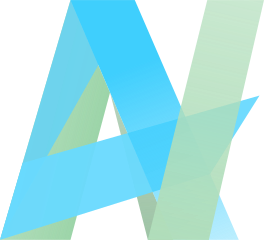

  <h1>
    Hi there, I'm Libsod! 
    
  </h1>
  

    
    
  

<h1 align="center">About me </h2>

<h3 align="center">I'm 18 y.o. student, Neovim and terminal enthusiast with a passion for FOSS, rising & low-level programming</h3>

  
  

 #### &ensp; I'm also:
 

   <ul>
     <li>Love learning things related to Linux & other OSs, tinkering with my Nix config and Dotfiles, listening music, reflecting & admiring nature</li>
     <li>Interested in reproducible & scalable systems, type systems, functional programming & etc.</li>
     <li><b>Really interested in</b> philosophy (hobby), low-level programming, programming languages, system & software architecture & computer science</li>
   </ul>
 

 

#### &ensp; The projects I'm currently working on:

  <ul>
    <li>
      

        
        <a href="https://github.com/Libsod/zig-tools.nvim">zig-tools</a> — A feature-rich (someday in future) Neovim plugin that provides development tools for Zig
      

    </li>
    <li>
      

        
        <a href="https://github.com/AstroNvim/astrocommunity">astrocommunity</a> — A repo of plugin specifications for Astro Neovim distribution 
      

    </li>
  </ul>

